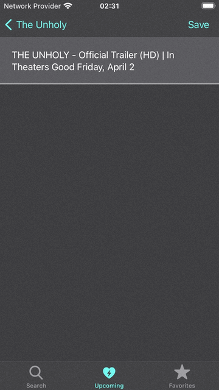

## Movie Details - Portrait (iPhones and iPads)
## UIKit - No Xib - No Storyboard - No SwiftUI
### Dark and Light mode supported

This application uses ["themoviedb" REST webservice.](https://developers.themoviedb.org/3)  
See the following link concerning Privacy Policy of "themoviedb": [Privacy Policy](https://www.themoviedb.org/privacy-policy)  
See the following link concerning the API term of use of "themoviedb" REST API: [Term of Use](https://www.themoviedb.org/documentation/api/terms-of-use)  

 

This application lets the user find more information about past and upcoming movies. 
The user can see the poster of a movie, read its synopsis and watch associated videos (e.g. trailers, bloopers)

## Contact

If you have any questions contact me at <a href="mailto:spencer.forrest.ios@gmail.com">spencer.forrest.ios@gmail.com</a>

## Movie Grid Screen

The user can see a list of movies and select one. 
He/she can go back to the top of the list by clicking on the "top" icon in the top right corner. 

 

## Movie Information Screen

The user can read the synopsis of the movie. The movie can be added to and removed from the favorite list. 

 

## Video List Screen

The user can see the list of videos associated with the movie (Trailers, bloopers, etc). 
The movie can be added to and removed from the favorite list. 

 

The user can watch the selected video on youtube or vimeo either through their app, if installed on the device, 
or through the embedded Safari web browser (Portrait or Landscape mode). 

 

## Search Screen

The user can search a movie by entering parts of its title. 

 

## Upcoming Screen

The user can select a region. The region of the device is the default one. The selected region is persisted. 
The user can search for a region within the list.
The user can go back to the top of the list by clicking on the "top" icon in the top right corner. 

 

## Favorite List Screen

The user can search for a movie in his/her favorite list by using its title. 
The user can go back to the top of the list by clicking on the "top" icon in the top right corner. 
The user can remove a movie from the list of favorites by swiping left and pushing the delete button. 
The user can remove a movie from the list of favorites by swiping entirely left. 

 
